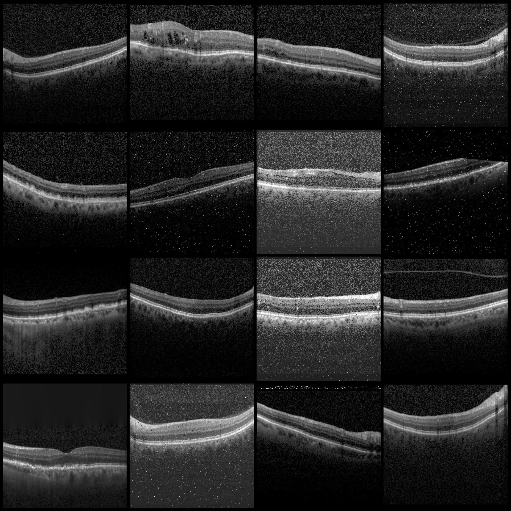
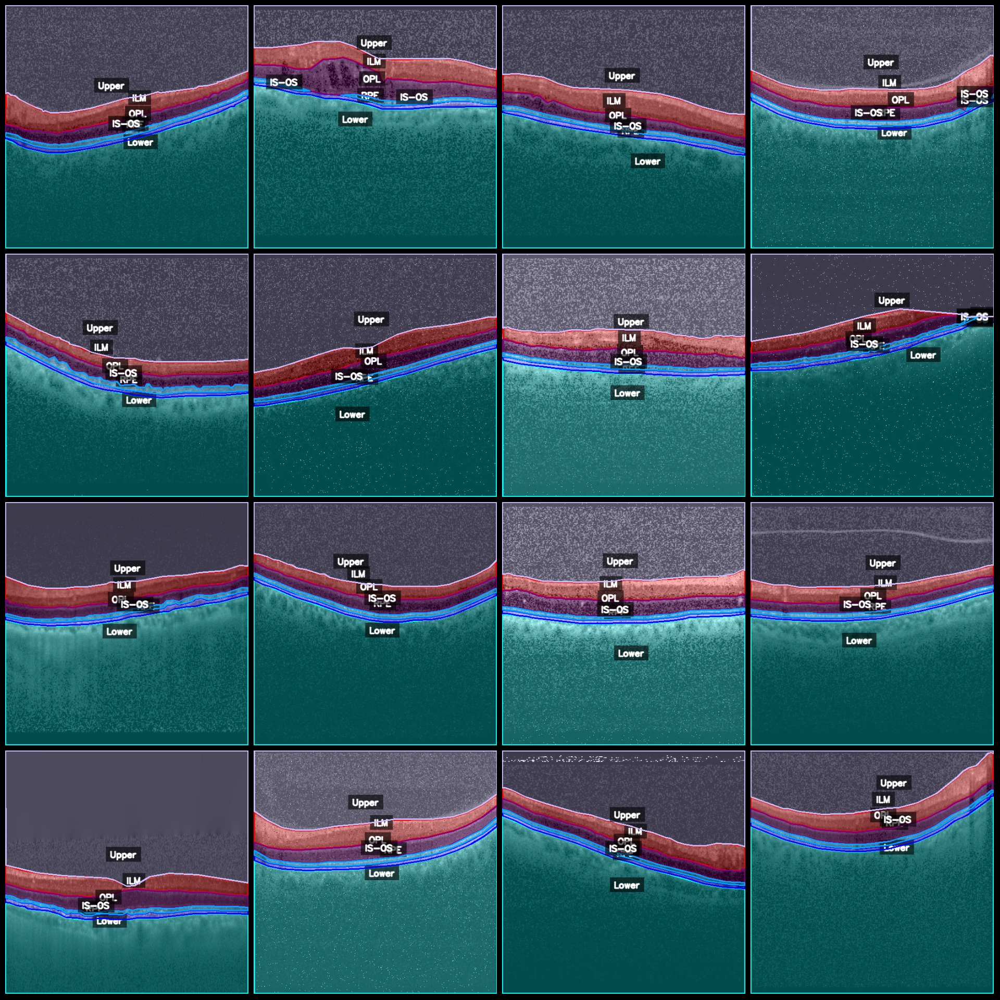
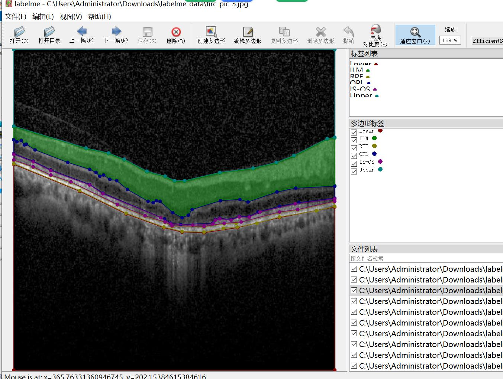

# Wisdom Medical Optical Coherence Tomography OCT Retinal Image Segmentation Dataset - LabelMe Format with 12948 Images and 6 Categories with Enhanced

Please note that approximately 4500 images in the dataset are original, while the remaining are noise-enhanced images formed by a 1:2 enhancement process. The enhanced images are created by adding 
different noise densities, and please note that the images may not be very clear. Please review the image previews for details.
The dataset format is labelme (excluding mask files, only containing JPG images and corresponding JSON files).
The number of images (JPG file counts): 12948
The number of annotations (JSON file counts): 12948
The number of annotation categories: 6
Annotation category names: ["ILM", "IS-OS", "Lower", "OPL", "RPE", "Upper"]
Number of bounding boxes per category:
ILM (Inner Membrane) count = 13309
IS-OS (Photoreceptor inner segments/outer segments) count = 17501
Lower (Lower regions) count = 12948
OPL (Outer plexiform layer) count = 13346
RPE (Retinal pigment epithelium) count = 13829
Upper (Upper regions) count = 12953
Total bounding box count: 83886
Annotation tool used: labelme=5.5.0
Image resolution: 512x512
Annotation rules: Polygons are drawn around the categories
Important Notice: You can open the dataset using labelme to edit it; the JSON dataset should be converted into either mask or yolo format or coco format for semantic segmentation or instance 
segmentation.
Special Declaration: This dataset does not guarantee any accuracy in the training models or weights files.
Image Preview:
Annotation example:
Original image (randomly selected 16 images):
Annotation drawing results:

## Images

Here is a pay link on Stripe ( https://buy.stripe.com/3cs8yP7sY87d0vu9AB ). Please contact me lonlonago@foxmail.com after funding $89, and I will send you a complete data files , thank you!

